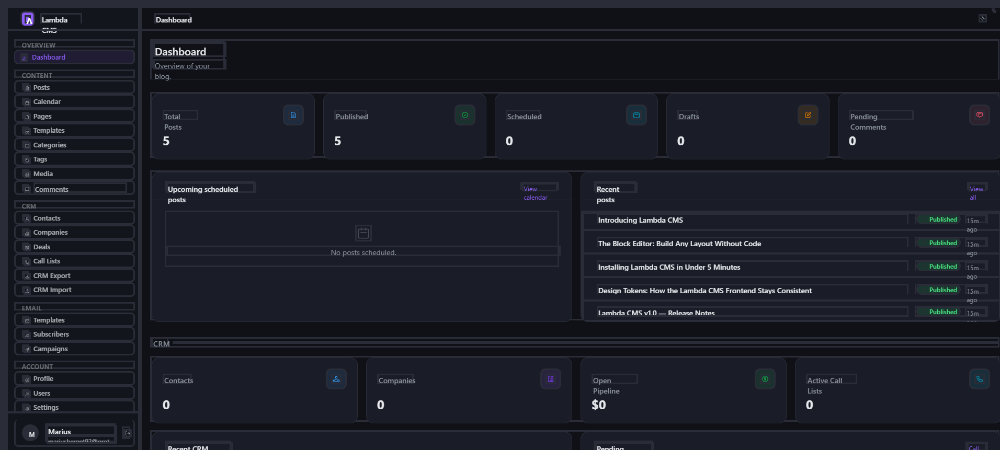
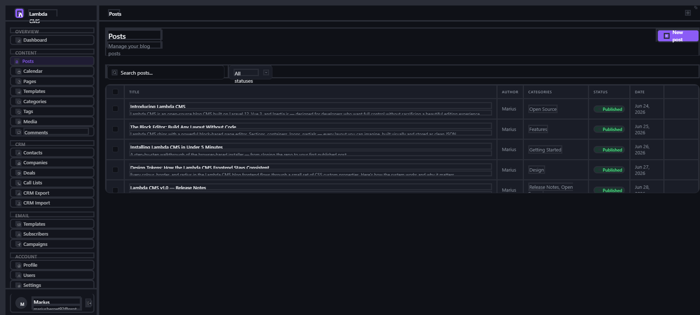
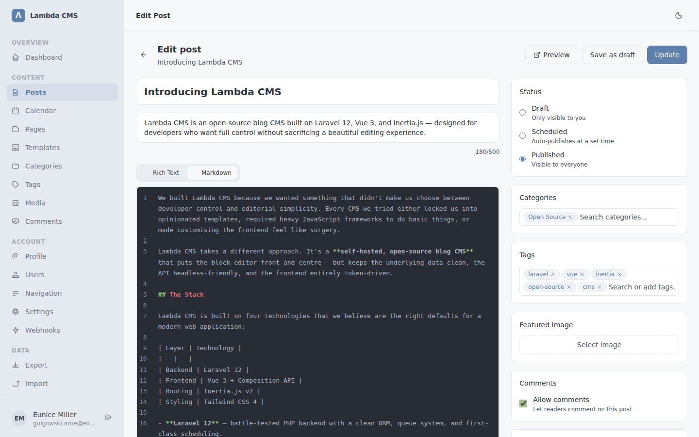
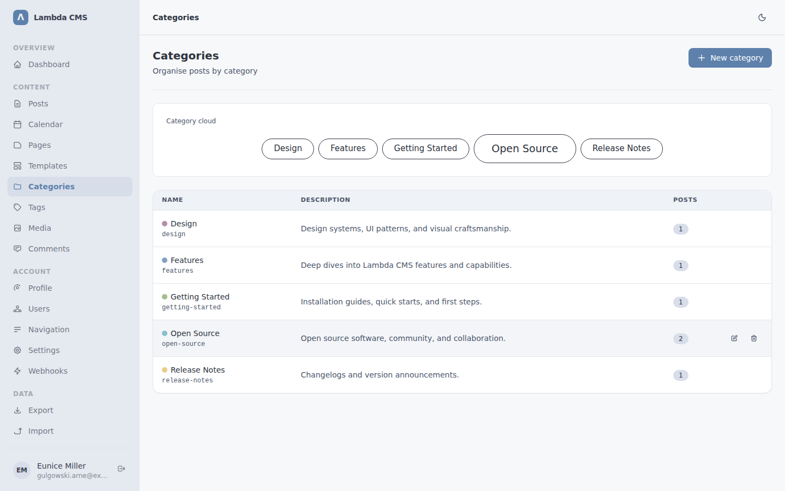
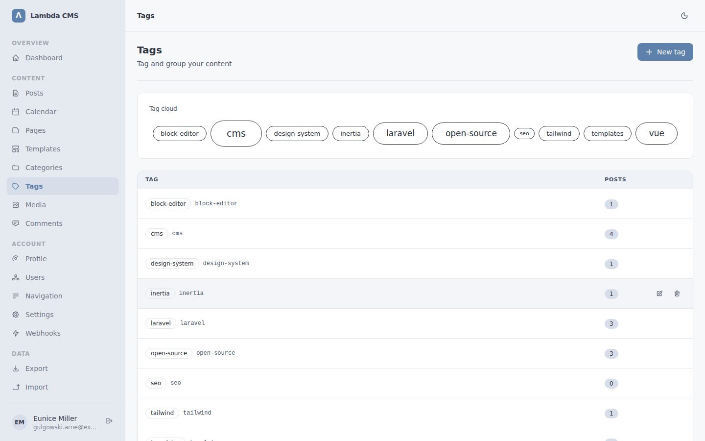
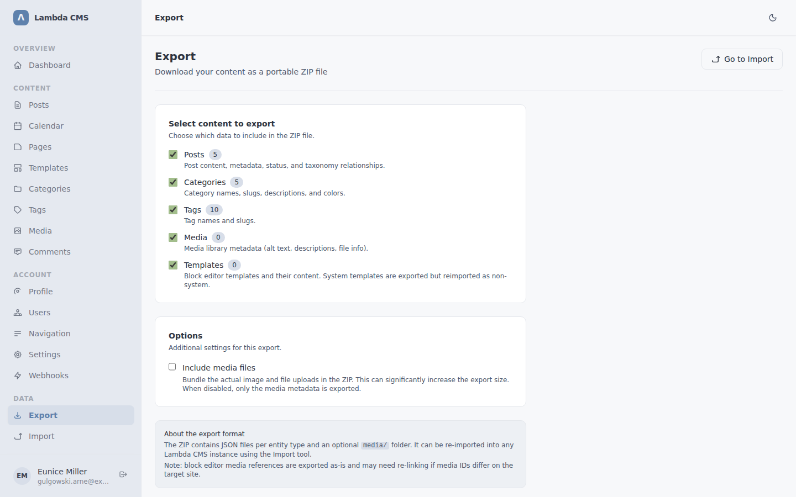

<div align="center">

# Lambda CMS

**A modern, self-hosted CMS + CRM built for developers.**
Block editor · CRM · Email campaigns · In-browser image editor · 2FA · Headless API · No cloud lock-in.

[](LICENSE)
[](https://laravel.com)
[](https://php.net)
[](https://vuejs.org)

**[Read the Docs](https://lambdacms.darkleaks.net)**

</div>

---

## Screenshots

<table>
  <tr>
    <td></td>
    <td></td>
  </tr>
  <tr>
    <td align="center"><sub>Dashboard — post stats and recent activity</sub></td>
    <td align="center"><sub>Posts — list with search, filters, and bulk actions</sub></td>
  </tr>
  <tr>
    <td></td>
    <td></td>
  </tr>
  <tr>
    <td align="center"><sub>Post editor — Tiptap rich-text with sidebar metadata</sub></td>
    <td align="center"><sub>Categories — color-coded with cloud and table view</sub></td>
  </tr>
  <tr>
    <td></td>
    <td></td>
  </tr>
  <tr>
    <td align="center"><sub>Tags — weighted tag cloud with post counts</sub></td>
    <td align="center"><sub>Export — select entities and download a portable ZIP</sub></td>
  </tr>
</table>

---

## What is Lambda CMS?

Lambda CMS is a clean, fast, fully self-hosted content management system with a built-in CRM and email marketing toolkit. No subscriptions, no SaaS lock-in — you own your data and your stack. Built with **Laravel 12**, **Vue 3**, and **Inertia.js**, it feels like a modern SPA while keeping the server-side simplicity of a traditional Laravel app.

## Tech Stack

| Layer | Technology |
|---|---|
| Backend | Laravel 12, PHP 8.2+ |
| Frontend | Vue 3 (Composition API), Inertia.js 2, Tailwind CSS 4, Vite 7 |
| UI | shadcn-vue, reka-ui, Lucide icons |
| Rich Text | Tiptap |
| Database | SQLite (default) or MySQL |

---

## Features

### Content Management

- **Posts** — full CRUD with Tiptap rich text or the drag-and-drop block editor
- **Pages** — static pages built entirely with the block editor
- **Categories & Tags** — many-to-many on posts; categories support custom colors
- **Scheduled publishing** — set a future date and posts go live automatically via the scheduler
- **Autosave** — drafts save quietly in the background while you write
- **Revisions** — full history with one-click restore (up to 25 per post/page)
- **Draft previews** — shareable token-based URLs, no login required
- **Bulk actions** — publish, draft, or delete multiple posts at once

### Block Editor

30+ block types across six categories:

| Category | Blocks |
|---|---|
| Content | Paragraph, Heading, Quote, Code, Divider, Spacer, HTML, Accordion, Tabs, Embed |
| Media | Image, Gallery, Video |
| Layout | Section, Container (flex / grid / inline-flex) |
| Interactive | Button, CTA, Link, Navigation, Search, Filter Link, Active Filter, Icon List |
| Data | Loop, Pagination, Post Card, Post Title, Post Body, Post Featured Image, Post Meta, Post Author, Post Taxonomy, Post Comments, Archive Title |
| Site | Nav Header, Site Footer, Masthead, Band, Template |

**What makes it nice to use:**

- Drag-and-drop canvas with cross-list nesting and a layers panel tree
- Per-block Style tab — typography, colors, background (solid / gradient / image), border, shadow, spacing
- Dynamic field bindings — link block content to loop or post-context data sources
- Per-block Advanced settings — custom CSS classes, inline CSS, font family
- Conditional block visibility based on loop field values
- Block labels shown in canvas and layers panel

### Media Library & Image Editor

- Upload images, documents, video, and audio (configurable size limit, default 10 MB)
- **In-browser image editor** — crop with 9 aspect ratio presets, rotate, flip, 8 filter presets (Normal, Vivid, Muted, B&W, Warm, Cool, Fade, Drama), and manual brightness / contrast / saturation / blur controls. Opens before upload and on any existing library item.
- Auto-resize images larger than the configured limit (default 1920 px wide)
- Alt text and description per file; UUID-based filenames with dimension tracking
- Admins see all files; users see their own

### Template System

- **7 pre-shipped system templates** — Post Card, Default Blog Index, Default Single Post, Default Archive, Default Search Results, Default Header, Default Footer
- Custom templates share the same block editor, autosave, and revisions
- Loop blocks correctly inherit context for dynamic bindings

### Public Frontend

- Every public page rendered from editable block templates
- Header and footer rendered from dedicated block templates
- Blog index, single post, category/tag archives, and full-text search
- RSS feed at `/feed` and XML sitemap at `/sitemap.xml`
- Design token system — accent color applies live to both admin and blog
- Admin bar visible to authenticated users only

### Comments

- Public submission with honeypot spam protection and rate limiting
- Admin moderation — approve, reject, or delete individually or in bulk
- Nested replies with email notifications
- Per-post toggle to enable/disable comments

### CRM

A built-in customer relationship management system with permission-based access control. Each module can be granted independently to non-admin users.

- **Contacts** — manage people with name, email, phone, notes, and company association. Full-text search across all fields.
- **Companies** — organize contacts under companies. Link contacts to companies with one-click association.
- **Deals** — track sales opportunities through a 5-stage pipeline: Lead, Qualified, Proposal, Won, Lost. Each deal tracks value, expected close date, and links to a contact and company. Activity timeline per deal.
- **Call Lists** — create lists of contacts for outreach campaigns. Add/remove contacts, track call status per contact (pending, called, no answer, callback, completed), record notes, and work through the list with a dedicated calling interface.
- **CRM Import** — upload a CSV, preview rows, map columns to contact/company/deal fields, choose a conflict strategy (skip or overwrite), and import in bulk.
- **CRM Export** — select which CRM entities to include and download as CSV.

### Email System

Customizable transactional emails, subscriber management, and email campaigns — all in one place.

- **Editable system email templates** — 5 built-in templates (password reset, email verification, welcome, new comment, comment reply) stored in the database with a WYSIWYG editor. Each template supports merge tags (e.g. `{{user_name}}`, `{{reset_url}}`), live preview, and one-click reset to default. All Laravel system emails (password reset, verification, welcome, comment notifications) route through these templates automatically.
- **Subscriber management** — a standalone subscribers table (separate from CRM contacts) for newsletter signups. Public subscribe form (Blade page at `/subscribe`) and token-based unsubscribe link. Admin interface with search, status filtering (active / unsubscribed), bulk delete, CSV export, and CSV import with column mapping and conflict strategy.
- **Email campaigns** — create newsletters with the Tiptap editor, save as draft, and send to all active subscribers with one click. Sending is handled by a queued job that processes each recipient individually. Per-recipient tracking with sent/failed/pending status and error messages. Campaign report page with stat cards and a recipients table. Campaigns that have been sent cannot be edited or re-sent.
- **Unsubscribe footer** — every campaign email includes an unsubscribe link with the subscriber's unique token.

### Users & Roles

- Two roles: **administrator** and **user**
- Admins manage all content, users, settings, pages, and templates
- Users manage their own posts, categories, tags, and media
- Fine-grained CRM and email permissions: manage contacts, manage companies, manage deals, manage call lists, manage email
- Avatar upload per profile
- User invite flow — auto-generated password + welcome email
- User banning with reason and optional expiry (auto-lifted on next login)
- Online status tracking

### Auth & Security

- Email + password login with rate limiting (5 attempts / 60 s per email + IP)
- **Two-factor authentication** — TOTP-based 2FA compatible with Google Authenticator, Authy, 1Password, and any RFC 6238 app. Includes 8 single-use recovery codes.
- Forgot / reset password via email token
- Email verification required before dashboard access
- Author-scoped post and media access

### Webhooks

- Events: `post.published`, `post.updated`, `post.deleted`, `page.published`, `page.updated`, `page.deleted`
- HMAC-SHA256 request signature (`X-Lambda-Signature`) when a secret is set
- Dispatched via queued jobs; `last_triggered_at` tracked per webhook

### Editorial Calendar

- Month-view calendar with published, scheduled, and draft posts
- Unscheduled drafts panel alongside the calendar
- Admins see all; users see their own

### Settings

- Site name, URL, timezone, and date format
- SEO defaults (meta description, OG image, keywords, title separator)
- SMTP mail configuration with test-send
- Media upload limits and image resize threshold
- Comments (enabled toggle, items per page)
- Appearance: accent color applied live to admin and blog frontend
- UI density: default, compact, or comfortable
- Custom JS injection on every public page

### REST API (Headless)

```
GET  /api/v1/posts
GET  /api/v1/posts/{slug}
GET  /api/v1/categories
GET  /api/v1/categories/{slug}
GET  /api/v1/tags
GET  /api/v1/tags/{slug}
POST /api/v1/query        <- block editor loop data source
```

### Import / Export

Export your content as a portable ZIP and re-import it into any Lambda CMS instance.

**Supported entities:** Posts, Pages, Categories, Tags, Media, Templates

**Export** — pick which entities to include, optionally bundle media files, and download a `.zip`. **Import** — upload a ZIP, preview what's inside, select entities, choose a conflict strategy (`skip`, `overwrite`, or `duplicate`), and run.

<details>
<summary><strong>ZIP structure and JSON schemas</strong></summary>

The export ZIP contains a `manifest.json`, one JSON file per entity type, and an optional `media/` folder:

```
lambda-cms-export-2026-06-15-120000.zip
├── manifest.json
├── posts.json
├── pages.json
├── categories.json
├── tags.json
├── media.json
├── templates.json
└── media/
    ├── a1b2c3d4-photo.jpg
    └── e5f6g7h8-document.pdf
```

#### manifest.json

```json
{
  "version": "1.0",
  "app": "lambda-cms",
  "exported_at": "2026-06-15T12:00:00.000000Z",
  "entities": ["posts", "pages", "categories", "tags", "media", "templates"],
  "include_media_files": true,
  "counts": {
    "posts": 12,
    "pages": 3,
    "categories": 5,
    "tags": 8,
    "media": 20,
    "templates": 4
  }
}
```

#### posts.json

```json
[
  {
    "title": "My First Post",
    "slug": "my-first-post",
    "excerpt": "A short summary",
    "body": "<p>HTML content</p>",
    "body_format": "html",
    "status": "published",
    "featured": false,
    "published_at": "2026-06-01T10:00:00.000000Z",
    "comments_enabled": true,
    "use_block_editor": false,
    "blocks": [],
    "meta_title": null,
    "meta_description": null,
    "meta_keywords": null,
    "custom_js": null,
    "categories": ["tutorials", "laravel"],
    "tags": ["php", "cms"],
    "featured_image": "a1b2c3d4-photo.jpg"
  }
]
```

| Field | Type | Notes |
|---|---|---|
| `title` | string | Required |
| `slug` | string | Used for conflict detection. Auto-generated on duplicate strategy |
| `excerpt` | string\|null | Plain text summary |
| `body` | string\|null | HTML content (when `body_format` is `html`) |
| `body_format` | `"html"` \| `"blocks"` | Determines whether `body` or `blocks` holds the content |
| `status` | `"draft"` \| `"published"` \| `"scheduled"` | Defaults to `draft` on import |
| `featured` | boolean | |
| `published_at` | ISO 8601\|null | |
| `comments_enabled` | boolean | |
| `use_block_editor` | boolean | |
| `blocks` | array | Block editor JSON (when `body_format` is `blocks`) |
| `meta_title` | string\|null | SEO title override |
| `meta_description` | string\|null | SEO description |
| `meta_keywords` | string\|null | SEO keywords |
| `custom_js` | string\|null | Per-post JavaScript |
| `categories` | string[] | Array of category slugs — resolved on import |
| `tags` | string[] | Array of tag slugs — resolved on import |
| `featured_image` | string\|null | Media filename — resolved to a media ID on import |

#### pages.json

```json
[
  {
    "title": "About Us",
    "slug": "about-us",
    "status": "published",
    "blocks": [
      { "type": "heading", "data": { "text": "About Us", "level": 1 } },
      { "type": "paragraph", "data": { "text": "Welcome to our site." } }
    ],
    "meta_title": null,
    "meta_description": null,
    "meta_keywords": null,
    "custom_js": null
  }
]
```

| Field | Type | Notes |
|---|---|---|
| `title` | string | Required |
| `slug` | string | Used for conflict detection |
| `status` | `"draft"` \| `"published"` | Defaults to `draft` on import |
| `blocks` | array | Block editor JSON |
| `meta_title` | string\|null | SEO title override |
| `meta_description` | string\|null | SEO description |
| `meta_keywords` | string\|null | SEO keywords |
| `custom_js` | string\|null | Per-page JavaScript |

#### categories.json

```json
[
  {
    "name": "Tutorials",
    "slug": "tutorials",
    "description": "Step-by-step guides",
    "color": "#5e81ac",
    "hue": 213
  }
]
```

#### tags.json

```json
[
  {
    "name": "PHP",
    "slug": "php"
  }
]
```

#### media.json

```json
[
  {
    "id": 1,
    "filename": "a1b2c3d4-photo.jpg",
    "original_filename": "photo.jpg",
    "disk": "public",
    "path": "media/a1b2c3d4-photo.jpg",
    "mime_type": "image/jpeg",
    "type": "image",
    "size": 204800,
    "width": 1920,
    "height": 1080,
    "alt": "A landscape photo",
    "description": null
  }
]
```

When `include_media_files` is enabled, the actual files are bundled under `media/` in the ZIP, keyed by `filename`.

#### templates.json

```json
[
  {
    "title": "Default Blog Index",
    "type": "index",
    "loop_source": "posts",
    "status": "published",
    "blocks": [],
    "meta_title": null,
    "meta_description": null,
    "meta_keywords": null
  }
]
```

| Field | Type | Notes |
|---|---|---|
| `title` | string | Used with `type` for conflict detection |
| `type` | `"index"` \| `"single"` \| `"archive"` \| `"search"` \| `"header"` \| `"footer"` \| `"partial"` | Template type |
| `loop_source` | string\|null | Data source for loop blocks (e.g. `"posts"`) |
| `status` | `"draft"` \| `"published"` | When importing a published non-partial template, other published templates of the same type are demoted to draft |
| `blocks` | array | Block editor JSON |

#### Conflict strategies

| Strategy | Behavior |
|---|---|
| **Skip** | Leave existing records untouched. Only create records that don't exist yet. |
| **Overwrite** | Update existing records with the imported data. Matched by slug (posts, pages, categories, tags), filename (media), or title + type (templates). |
| **Duplicate** | Always create new records, generating a unique slug when needed. |

</details>

### Installer

- 4-step browser wizard: **Database > Site > Admin > Mail**
- Supports SQLite and MySQL; tests the DB connection before writing `.env`
- Runs migrations, seeds system templates, and creates the first admin account

---

## Getting Started

### Requirements

- PHP 8.2+
- Composer
- Node.js 20+ and npm
- SQLite (bundled with PHP) or MySQL 8+

### Install

```bash
git clone https://github.com/mariusberget92/lambda-cms.git
cd lambda-cms

composer install
npm install

cp .env.example .env
php artisan key:generate

npm run build
```

Open the site in a browser — you'll be redirected to `/install` to run the setup wizard.

### Local Development

```bash
php artisan serve
npm run dev
```

### Production

```bash
php artisan config:cache
php artisan route:cache
php artisan view:cache
npm run build
```

Add a cron entry to run the scheduler (handles auto-publishing and queued emails):

```
* * * * * cd /path/to/lambda-cms && php artisan schedule:run >> /dev/null 2>&1
```

For email campaigns and other queued jobs, start a queue worker:

```bash
php artisan queue:work
```

---

## Roadmap

- [x] Full import / export (posts, pages, categories, tags, media, templates)
- [x] CRM (contacts, companies, deals, call lists, import/export)
- [x] Email system (editable templates, subscribers, campaigns)
- [ ] API write access — token-based auth for creating and updating content
- [ ] Multi-language / i18n content support

---

## License

MIT — do whatever you want with it.
